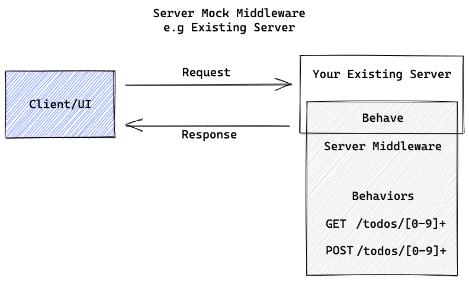
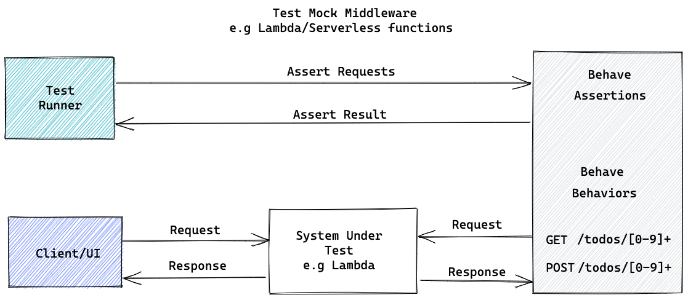

 <h1 align="center">Behave</h1>
 <p align="center">
The easiest and quickest way to mock HTTP endpoints for development and testing purposes
 </p>
 <p align="center">
    <a href="https://sayjava.github.io/behave/"><strong>Explore Behave docs »</strong></a>
 </p>
 <p align="center">
  <a href="https://sayjava.github.io/behave/">Quick Start »</a>
  <a href="https://sayjava.github.io/behave/guide">Guide »</a>
  <a href="https://sayjava.github.io/behave/api">API »</a>
  <a href="https://sayjava.github.io/behave/assertions">Assertions</a>
 </p>

## Quick Start

```shell
npx @sayjava/behave -b '[{"request": {"path":"/hi"}, "response": {"body": "Hello World"}}]'
```

This will start the server on port 8080, then run a sample request against the server to see the response

```shell
curl -X GET http://localhost:8080/hi
```

## Features
- Standalone http mock server
- HTTP Assertion server
- NodeJS/Express Middleware
- API Spec compliant
- Serverless Ready (see examples folder)

## Useful Mocking Scenarios

These are some basic scenarios that behave can help with during the development and testing process

- As a standalone mock system that is useful for testing and mocking out APIS
<p align="center">

</p>

- Existing application can be mocked using  
<p align="center">

</p>

- Test UI/Middleware systems. For example, checking what requests where made e.t.c
<p align="center">

</p>

## Mocking Examples

Here are some scenarios where `Behave` can be used to mock endpoints

- Regex paths

```shell
curl -v -X PUT http://localhost:8080/_/api/behaviors -d '[
  {
    "name": "Match any task with id",
    "request": { "path": "/tasks/[0-9]+" },
    "response": "found it"
  }
]
'
```

to match requests like:

```shell
curl -v -X GET http://localhost:8080/task/2
curl -v -X GET http://localhost:8080/task/10
```

- Request headers e.g `{"user-agent": "Chrome|Apple*"}`

```shell
curl -v -X PUT http://localhost:8080/_/api/behaviors -d '[
  {
    "name": "Match requests coming from Apple devices or Chrome",
    "request": {
      "path": "/tasks/[0-9]+",
      "headers": {
        "user-agent": "Chrome|Apple*"
      }
    },
    "response": [
      {
        "name": "Created on the mac"
      }
    ]
  }
]
'
```

to match requests like:

```shell
curl -v -X GET http://localhost:8080/task/2 -H 'user-agent: Chrome'
```

- Response Body e.g `{"user":"john_[a-z]+"}`

```shell
curl -v -X PUT http://localhost:8080/_/api/behaviors -d '[{
  "name": "Match requests with users with names like john_xxx",
  "request": {
    "path": "/tasks",
    "method": "POST",
    "body": {
      "user": "john_[a-z]+"
    }
  },
  "response": [
    {
      "statusCode": "201",
      "body": "Task created"
    }
  ]
}]
'
```

to match requests like:

```shell
curl -v -X POST http://localhost:8080/tasks -d '{ "user": "john_doe", "name": "pay up" }'
```

- Simulate network delays and failures

```shell
curl -v -X PUT http://localhost:8080/_/api/behaviors -d '[
  {
    "name": "Match any task with id",
    "request": {
      "path": "/tasks/[0-9]+",
      "delay": 100
    }
  }
]
'
```

- Alternate responses for the same request. e.g succeed twice then fail afterwards

```shell
curl -v -X PUT http://localhost:8080/_/api/behaviors -d '[
  {
    "request": {
      "path": "/hello/world"
    },
    "response": {
      "statusCode": "200",
      "body": "Hello there"
    },
    "limit": 2
  },
  {
    "request": {
      "path": "/hello/world"
    },
    "response": {
      "statusCode": "500",
      "body": "Sorry Server Blew Up"
    }
  }
]
'
```

[see more examples](docs/guide.md)

## Useful Testing Scenarios

- Validate received requests. e.g

```shell
# Assert that this request was received at most 2 times
curl -v -X PUT http://localhost:8080/_/api/requests/assert -d `[
    {
        "path": "/hello/world",
        "count": {
            "atMost": 2
        }
    }
]`
```

- Validate the interval between requests

```shell
# Assert that these requests were received at most 10 seconds apart
curl -v -X PUT http://localhost:8080/_/api/requests/intervarl -d `
  {
    "path": "/hello/world",
    "interval": {
      "atMost": 10
    }
  }
`
```

- Validate the order in which requests are received

```shell
# Assert that these requests were received in this order
curl -v -X PUT http://localhost:8080/_/api/requests/sequence -d `[
    {
        "path": "/hello/world",
    }
]`
```

## Programmatically Use cases (Express Middleware / NodeJS HTTP Middleware)

See 
- Express Middleware

```javascript
const express = require("express");
const { behaveHandler } =  require("@sayjava/behave");

const app = express();

app.use(express.static(__dirname + '/views'));

// Existing route
app.get('/', function (req, res) {
  res.render('index', { title: 'Hey', message: 'Hello there!' })
})

// Handle all other routes, e.g /api/user. 
app.use(behaveHandler({config:{ fromFile: "behaviors.json" }}));

app.listen(3000, () => {
  console.info(`Weather ite started on 3000`);
});

```


## Serverless Mock Server
See [Serverless Deployment](examples/behave-on-lambda/README.md)
:::Note Assertion does not work in the serverless:::


## Full Documentation

[Full Documentation](https://sayjava.github.io/behave)
